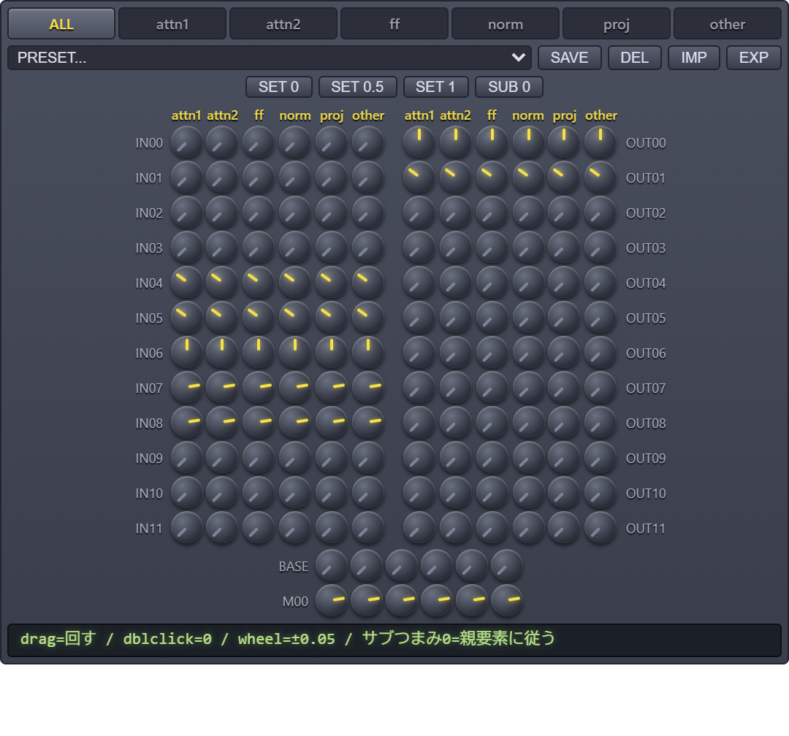
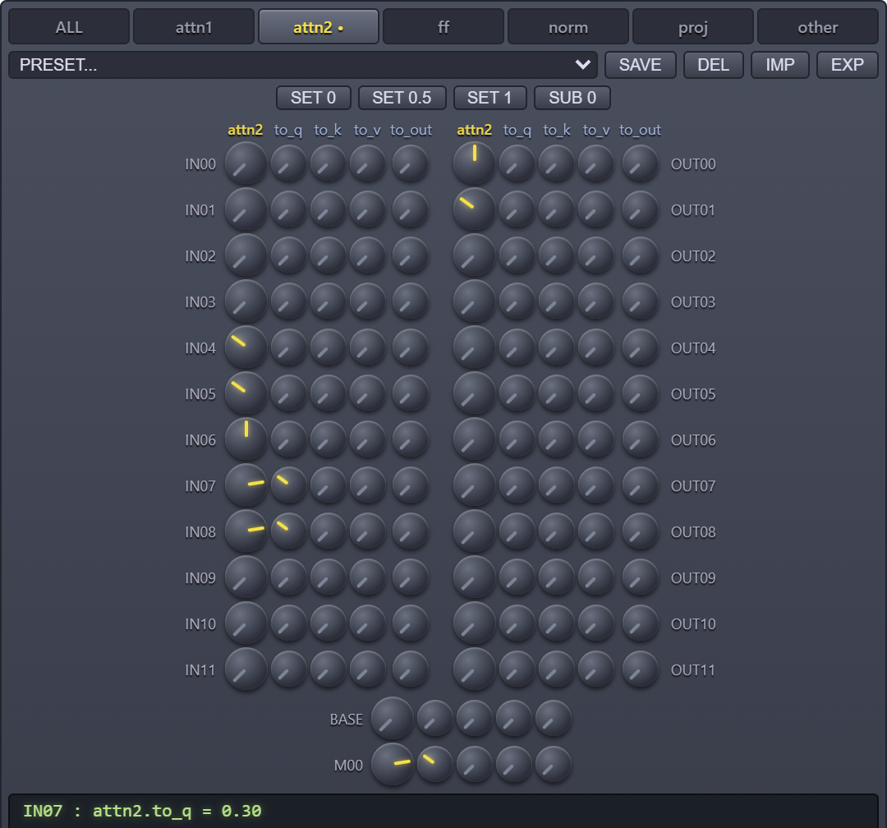

# ComfyUI-RecipeMerge

つまみ・スライダー・テキストレシピでUNetを**キー単位**(要素マージ)でマージするComfyUIカスタムノード集。
A1111拡張の [SuperMerger](https://github.com/hako-mikan/sd-webui-supermerger) の階層マージ/Elemental Mergeの**考え方**にインスパイアされた**独立実装**です(SuperMergerのコードは使用していません。無関係の別プロジェクトであり、本ノードの不具合を先方に問い合わせないでください)。

> **English**: Elemental (per-UNet-key) model-merge nodes for ComfyUI — a synth-style knob matrix (blocks × elements × sub-elements), MBW-style block sliders, and a text recipe format. Merge presets can be saved, exported as JSON, and shared: drop a preset JSON onto the node to apply it instantly. Independent implementation inspired by SuperMerger's block/elemental merge concept (no code shared with it). UI labels are currently Japanese. Note: ratio = "amount of model2" (same direction as SuperMerger's alpha, **opposite** of ComfyUI's `ModelMergeSimple`).



要素タブの中ではサブ要素(to_q/to_k/…)を個別に上書きできる:



## インストール

```
cd ComfyUI/custom_nodes
git clone https://github.com/galigali-san/ComfyUI-RecipeMerge
```

ComfyUIを再起動するだけ。**追加の依存ライブラリは無し**(ComfyUI標準機能のみで動く)。
ノードは `advanced/model_merging` カテゴリに3つ入っている:

| ノード | 向いている使い方 |
|---|---|
| **Elemental Matrix Merge (Knobs)** | シンセ風つまみマトリクス(ブロック×要素、タブでサブ要素まで)。直感的にいじりたいとき |
| **Block Sliders Merge (MBW)** | MBW風。BASE/IN/M/OUTのスライダーで階層マージ+elemental欄で要素上書き |
| **Elemental Merge (Recipe)** | 全部テキストレシピで指定。複雑な指定・レシピの保存/使い回しに |

## Elemental Matrix Merge (Knobs)

MBW風レイアウトのつまみマトリクス。**左列=IN00〜IN11、右列=OUT00〜OUT11、下段=BASE/M00**。
**比率はmodel2の割合で、全つまみ0=model1のまま**。

- **タブ切り替え**: `ALL` = 全要素×全ブロックの一覧 / `attn1`〜`other` = その要素の親つまみ(大)+**サブ要素列**を表示。どのタブも同じ値を共有している(表示が変わるだけ)
- **サブ要素列**: 要素タブの中で下位のキーを個別に上書きできる
  - `attn1` / `attn2` → to_q / to_k / to_v / to_out
  - `ff` → net.0 / net.2、`norm` → norm1 / norm2 / norm3
  - `proj` → proj_in / proj_out、`other` → in_layers / out_layers / emb_layers / skip_connection / conv
  - **サブつまみ0 = 親要素のつまみに従う**(非0にしたときだけ親を上書き)。上書きがある要素タブには `•` が付く
- **ドラッグ(上下)** で回す / **ダブルクリック** で0に戻す / **ホイール** で±0.05
- 下のパネルに今触っているつまみの値が出る
- `other` 列は「そのブロックの attn/ff/norm/proj **以外**のキー(conv等)」。各つまみは自分の領域だけを支配する
- SET 0 / SET 0.5 / SET 1 ボタンは**表示中のタブの親要素つまみだけ**に効く(attn2タブで押せばattn2だけ一括変更。サブは触らない)
- SUB 0 ボタンは表示中タブのサブ要素の上書きを全部消す(親に従う状態に戻す)
- **プリセット**(タブバー下のドロップダウン): マトリクス全体を名前を付けて保存/適用できる
  - SAVE = 現在のつまみ全部を保存(同名は上書き) / DEL = 選択中のユーザープリセットを削除
  - 保存先はComfyUIのユーザーデータ(`user/`)。ワークフローとは独立で、ノードを作り直しても残る
  - ★付きは同梱の定番MBWカーブ: FLAT_25/50/75(全部一定)、GRAD_V(両端強)、GRAD_A(中央強)、COS_IN(IN側強)、COS_OUT(OUT側強)、WRAP08(両端4ブロックだけ1.0)。**MBW移植なのでBASEはどれも0**
  - 適用でつまみ全部が置き換わる。直後ならドロップダウンの「(適用前に戻す)」で1段だけ戻せる
- **プリセットの共有**: EXP = 選択中のプリセット(未選択なら現在のつまみ)をJSONファイルに書き出し / IMP = JSONファイルを選んで**取り込み+即適用**。もらったJSONを**ノードのパネルに直接ドラッグ&ドロップ**しても取り込める(複数可、最後の1つが適用される)。同名がある場合は上書きか別名かを選べる
- reportには非0のブロックのルールだけが出る

### 同梱のサンプルプリセット

[presets/](presets/) にサンプルの共有プリセットが入っている。**ファイルをノードのパネルにドラッグ&ドロップするだけ**で取り込み+即適用される。

| ファイル | 内容 |
|---|---|
| `body2_face1_SDXL.json` | 「体つき=model2、顔=model1」の出発点。深いブロック(IN07/08・M00・OUT00/01)だけmodel2に振る |
| `body2_face1_faceguard_SDXL.json` | 上と同じブロック配分で**attn1/attn2だけ0**。顔がmodel2に引っ張られるときの強ガード版 |

### プリセット共有ファイルの形式

自作プリセットを配布するときはEXPボタンで書き出したJSONをそのまま配ればいい。形式:

```json
{
  "type": "recipe_merge_matrix_preset",
  "version": 1,
  "name": "体2顔1 (SDXL)",
  "matrix": {
    "IN07": { "attn1": 0.8, "attn2": 0.8, "ff": 0.8, "norm": 0.8, "proj": 0.8, "other": 0.8 },
    "M00":  { "other": 0.8 }
  }
}
```

`matrix` の中身は「ブロック名 → 要素名(サブ要素名も可) → 比率0〜1」。
ラッパー無しの素の `{ "IN07": {...} }` 形式でも取り込める。
ブロック名は `IN00`〜`IN11` / `M00` / `OUT00`〜`OUT11` / `BASE` のみ有効で、それ以外のキーと数値でない値は取り込み時に無視される(単なる数値データなので、コードが実行される余地はない)。

## Block Sliders Merge (MBW)

- **BASE / IN00〜IN11 / M00 / OUT00〜OUT11** の27本のスライダー(MBWの定番の並び。ComfyUIの仕様で縦一列)
- SDXLでは IN09〜IN11 / OUT09〜OUT11 は該当キーがないので動かしても無効(reportで0 keysと出る)
- **elemental欄**(テキスト)に `attn2:0.8` や `IN04:attn2:0.9` を書くとスライダーを上書きできる。文法は下記レシピと同じ(デフォルト行は無意味なので不要)
- `__VAL__` と sweep_value も使える

## 入出力

| ピン | 型 | 説明 |
|---|---|---|
| model1 | MODEL | ベースモデル(比率0.0 = これのまま) |
| model2 | MODEL | 混ぜるモデル |
| recipe | STRING | マージレシピ(下記文法) |
| sweep_value | FLOAT | レシピ内の `__VAL__` を置換する値(XYプロット用) |
| → model | MODEL | マージ結果 |
| → report | STRING | 各ルールが何キーに適用されたかのレポート |

**比率は「model2を混ぜる割合」**(SuperMergerのalphaと同じ向き)。
`0.0` = model1のまま、`1.0` = model2に置き換え。
ComfyUI標準の `ModelMergeSimple` の ratio とは**向きが逆**なので注意。

## レシピ文法

1行1ルール。`#` 以降はコメント。

```
# 数値だけの行 = デフォルト比率(どのルールにも当たらないキー全部)
0.5

# 要素の横断指定: 全ブロックのattn2を0.8
attn2:0.8

# NOT除外: attn2以外の全キーを0.3
NOT attn2:0.3

# ブロック+要素の狙い撃ち: IN04のattn2だけ0.9
IN04:attn2:0.9

# ブロック指定のみ(全要素): ワイルドカード可
IN*:0.4
M00:0.7

# カンマ区切りで複数指定
IN00,IN01,OUT*:ff:0.2

# 深い階層も指定可(ドット区切りで連続一致)
attn2.to_q:0.9

# 要素名は前方一致
# attn → attn1とattn2両方 / norm → norm1〜norm3
attn:0.6

# XYプロット用プレースホルダー(sweep_value入力の値が入る)
attn2:__VAL__
```

- ブロック名: `IN00`〜 / `M00` / `OUT00`〜 / `BASE`(time_embed, label_emb, out など)。大文字で書く
- 要素名: UNetキーのセグメント名。`attn1`(自己注意) `attn2`(クロス注意=プロンプト反応) `ff`(質感) `norm` `proj_in` `proj_out` など
- **優先度**: ブロック+要素 > 片方だけ > デフォルト。同点なら後の行が勝つ
- デフォルト行を書かなければ未指定キーは `0.0`(model1のまま)
- タイポ等で1キーにも当たらなかったルールは report に ★警告 が出る

## XYプロット(比率スイープ)のやり方

1. レシピに `attn2:__VAL__` のように書く
2. ノードの `sweep_value` ウィジェットを右クリック →「入力に変換」
3. XYプロット系ノード(efficiency-nodes等)や Float リストから値を流し込む

これで「attn2の比率だけ 0.0→1.0 でスイープした比較画像」が量産できる。

## 注意

- **マージしたモデルを配布する場合は、元モデルのライセンスを必ず確認すること**(マージや再配布を禁止・制限しているモデルがある)。本ノードはツールであり、生成・配布物のライセンス確認は利用者の責任
- マージ対象は **UNet(diffusion_model)のみ**。テキストエンコーダは model1 のものが使われる。CLIPも混ぜたい場合は標準の `CLIPMergeSimple` を併用
- 保存は標準の `CheckpointSave`。ワークフロー(=マージレシピ)がメタデータに埋まるので、消したい場合は `--disable-metadata` で起動するか後からヘッダを消す
- SD1.5 / SDXL 系(input/middle/output blocks 構造)を想定。Flux等のDiT系はブロックが全部 `BASE` 扱いになる(要素の横断指定とデフォルトは効く)

## テスト

```
python_embeded\python.exe custom_nodes\ComfyUI-RecipeMerge\test_parser.py
```

## クレジット / ライセンス

- MIT License — Copyright (c) 2026 galigali([LICENSE](LICENSE))
- インスパイア元: [SuperMerger](https://github.com/hako-mikan/sd-webui-supermerger) (hako-mikan氏) の階層マージ/Elemental Mergeの考え方。本リポジトリはコードを共有しない独立実装で、先方とは無関係
- 定番カーブ名(GRAD_V, FLAT_25等)は [Merge Block Weighted GUI](https://github.com/bbc-mc/sdweb-merge-block-weighted-gui) 発のコミュニティ慣用名(値は数式から生成)
